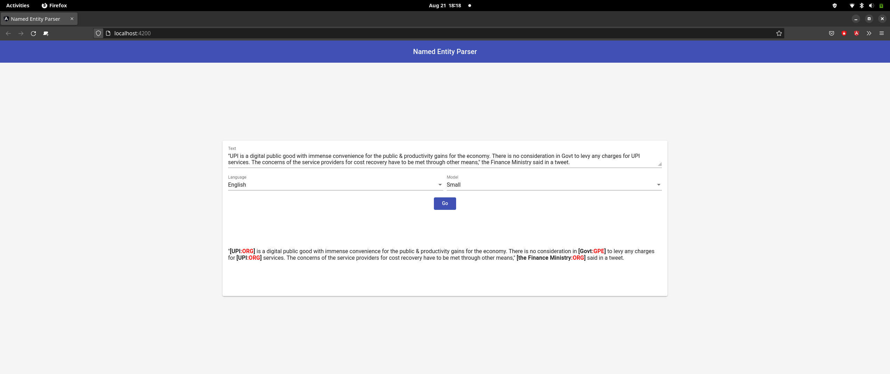

# Web-based named entity recognition

Originally developed in 2021 by Joe Cummings (@joecummings) and Jacob Lichtefeld (@lichtefeld). Updated in August 2022.

### Background

[Named entity recognition](https://en.wikipedia.org/wiki/Named-entity_recognition) (NER) is a very important and long-standing goal of the NLP community. In it, we attempt to identify and categorize "entities" from text so that we can use them for downstream processing such as argument attachment or [event extraction](http://ceur-ws.org/Vol-779/derive2011_submission_1.pdf).

### Steps to start the project

1. Make sure you have Node.js and npm installed.
        In case you don't have Node.js or npm installed, refer to the NodeSource blog posts Installing Node.js Tutorial: Using nvm (macOS and Ubuntu) or Installing Node.js Tutorial: Windows (Windows) for instructions.
2. We also recommend setting up a virtual environment for the Python dependencies. A good one is Miniconda, which you can then use in a manner similar to the following code snippet:
```
    conda create --name web-ner python=3.8
```
3. Activate the virtual environment ```conda activate web-ner```
4. Run  ```make install FRONTEND=angular-frontend BACKEND=flask-backend```
5. Run  ```make start FRONTEND=angular-frontend BACKEND=flask-backend```


### Screen Shot


> If you have any questions/comments while working on this, please reach out to your contact at ISI.
